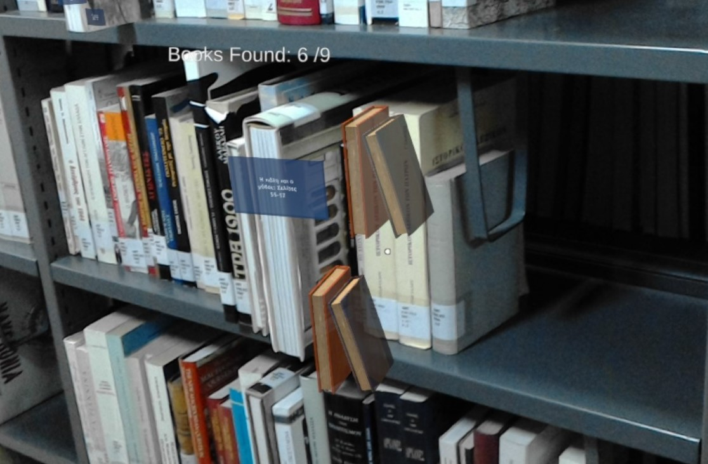
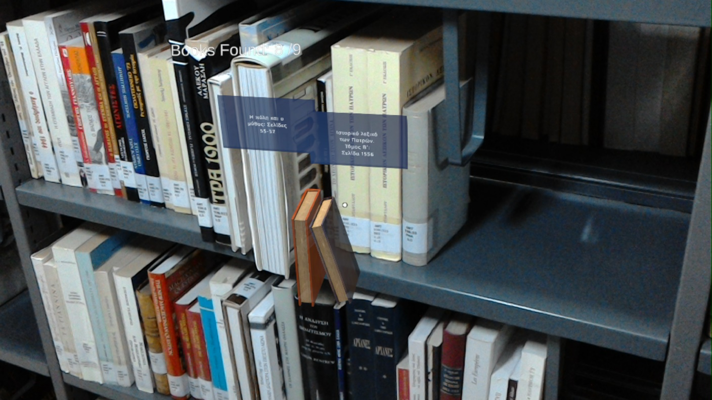

## LibraryVisionMR

Mixed Reality sample application built with Unity, Microsoft Mixed Reality Toolkit (MRTK), and Azure Spatial Anchors. The project targets Windows Mixed Reality/HoloLens and uses Unity 2019 LTS.

### Demo Video
[](https://youtu.be/kyfNb07vwUs)

### Tech stack

- **Unity**: 2019.4.36f1
- **MRTK**: 2.7.3 (foundation + standard assets)
- **Azure Spatial Anchors**: 2.8.1 (core + Windows)
- **Unity XR**: AR Foundation 3.1.3, ARCore 3.1.3, Windows Mixed Reality (UWP)
- **UI/Text**: TextMesh Pro

### Project layout (high level)

- `LibraryVisionMR/Assets/Scenes` — scenes (e.g., `SampleScene.unity`)
- `LibraryVisionMR/Assets/Scripts` — gameplay and MR scripts
- `LibraryVisionMR/Assets/Prefabs` — reusable prefabs
- `LibraryVisionMR/Assets/Books` — models, textures, and prefabs used by the app
- `LibraryVisionMR/Assets/MRTK` and `LibraryVisionMR/Assets/MixedRealityToolkit.Generated` — MRTK assets
- `LibraryVisionMR/Assets/Plugins` — third‑party plugins and platform libraries
- `LibraryVisionMR/Packages/manifest.json` — Unity package dependencies
- `LibraryVisionMR/ProjectSettings` — Unity project settings

### Prerequisites

- Windows 10/11
- Unity Hub with **Unity 2019.4.36f1** installed
- Visual Studio 2019/2022 with the following workloads:
  - Universal Windows Platform development
  - .NET desktop development (for tooling)
  - Game development with Unity (optional but recommended)
- HoloLens 2 device or Windows Mixed Reality headset (for deployment/testing)

### Getting started

1. Clone or copy the repository to a local folder with a short path (e.g., `C:\Dev\LibraryVisionMR`).
2. Open Unity Hub → Add → select the `LibraryVisionMR` folder → open with Unity 2019.4.36f1 or newer version.
3. Let Unity import assets and resolve packages.
4. Open `LibraryVisionMR/Assets/Scenes/SampleScene.unity` to explore the project.

### Important note about packages

This project pins specific mixed reality packages via `Packages/manifest.json`. One entry references a user‑specific local path for `com.unity.xr.legacyinputhelpers`:

```json
"com.unity.xr.legacyinputhelpers": "file:C:/Users/Spyros S/Desktop/Diploma/Addons/com.unity.xr.legacyinputhelpers-2.1.6"
```

If that path does not exist on your machine:

- Replace it with a registry version (e.g., `"2.1.9"`) in `LibraryVisionMR/Packages/manifest.json`, or
- Provide a valid local path to the `.tgz` or package folder on your system.

### Configuring Azure Spatial Anchors (ASA)

If the scene uses ASA, you will need an Azure Spatial Anchors account:

- Create an ASA resource in Azure Portal and gather the Account ID, Account Key, and Account Domain.
- In Unity, locate the ASA manager/configuration component used by the scene and set the credentials accordingly.
- Ensure app capabilities (InternetClient, SpatialPerception, etc.) are enabled for UWP builds.

### Build and deploy (HoloLens 2 / UWP)

1. In Unity: File → Build Settings…
   - Platform: Universal Windows Platform
   - Architecture: ARM64 (HoloLens 2)
   - Build Type: D3D
   - Target Device: Any Device / HoloLens
   - Visual Studio Version: Latest installed
   - Min Platform Version: 10.0.18362.0 or later
   - Check: "Unity C# Projects" if you need to debug C#
2. Player Settings → Capabilities: enable SpatialPerception, InternetClient, Microphone (if applicable), SpatialMapping.
3. Click Build and choose an empty `Build` folder.
4. Open the generated solution in Visual Studio.
5. Set Configuration: Release, Platform: ARM64, Device: Remote Machine or Device.
6. Deploy to HoloLens 2 (paired) or run on a target device/emulator.

### Troubleshooting

- **Package or compile errors**: Reopen the project with Unity 2019.4.36f1 and verify `manifest.json` entries. Fix or remove any user‑specific `file:` paths.
- **Missing MRTK/ASA assets**: Ensure the `.tgz` files referenced in `Packages/MixedReality` are present; re‑import packages if needed.
- **UWP build issues**: Confirm Visual Studio workloads, correct architecture (ARM64 for HoloLens 2), and required capabilities.

### Screenshots





